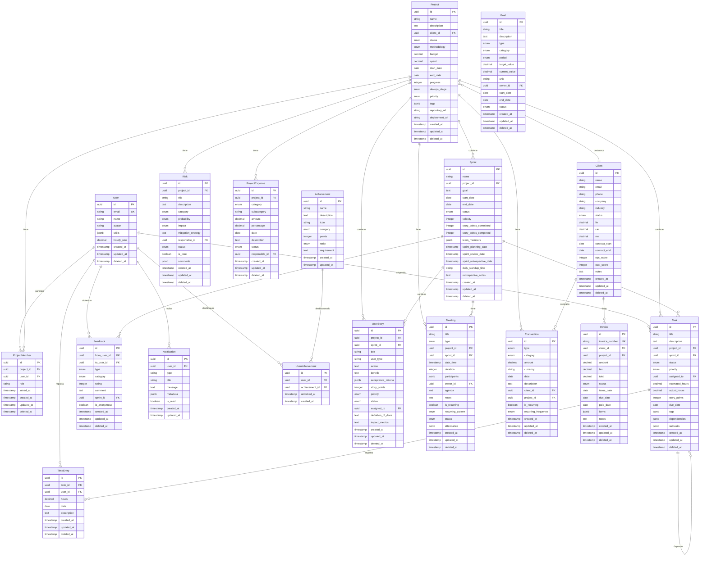

# Documento de Diseño

## Resumen General

Sistema backend GraphQL para gestión de equipos de desarrollo construido con NestJS, TypeScript, PostgreSQL (Supabase) y TypeORM. Implementa arquitectura CQRS sin Event Bus, Clean Architecture con separación de capas, y Domain-Driven Design con entidades de dominio y mappers.

### Stack Tecnológico

- **Framework**: NestJS 10.x
- **Lenguaje**: TypeScript 5.x
- **Base de Datos**: PostgreSQL 15+ (Supabase)
- **ORM**: TypeORM 0.3.x
- **API**: GraphQL con Apollo Server
- **Autenticación**: Supabase Auth + JWT Guards
- **Testing**: Jest + fast-check (property-based testing)
- **Validación**: class-validator + Joi (config)
- **Caché**: Redis (métricas en tiempo real)
- **CI/CD**: GitHub Actions + Vercel

### Principios Arquitectónicos

1. **CQRS sin Bus**: Commands (escritura) y Queries (lectura) invocados directamente desde controllers
2. **Clean Architecture**: Separación estricta entre dominio, aplicación e infraestructura
3. **Domain-Driven Design**: Entidades de dominio + Value Objects + Mappers
4. **Single Responsibility**: 1 controller = 1 endpoint = 1 handler
5. **Dependency Injection**: Todo inyectado, cero instanciación manual
6. **TDD**: Tests primero, cobertura mínima 80%

## Arquitectura

### Diagrama de Capas

```
┌─────────────────────────────────────────┐
│         GraphQL Layer                    │
│  (Resolvers + DTOs Request/Response)     │
└──────────────┬──────────────────────────┘
               │
┌──────────────▼──────────────────────────┐
│      Application Layer (CQRS)            │
│  Commands/Queries + Handlers (<20 lines) │
└──────────────┬──────────────────────────┘
               │
┌──────────────▼──────────────────────────┐
│         Domain Layer                     │
│  Entities + Value Objects + Interfaces   │
└──────────────┬──────────────────────────┘
               │
┌──────────────▼──────────────────────────┐
│      Infrastructure Layer                │
│  TypeORM Entities + Mappers + Repos      │
└──────────────────────────────────────────┘
```

### Flujo de Petición

```
GraphQL Resolver
  → DTO Request (validación)
  → Handler.handle(new Command(dto))
  → Repository Interface (dominio)
  → Repository Implementation (infraestructura)
  → Mapper (TypeORM ↔ Dominio)
  → TypeORM Entity
  → PostgreSQL
  → Mapper (Dominio ↔ TypeORM)
  → Domain Entity
  → DTO Response
  → GraphQL Response
```

## Componentes e Interfaces

### Módulos del Sistema

```
src/
├── auth/                    # Autenticación Supabase
├── users/                   # Gestión de usuarios
├── projects/                # Gestión de proyectos
├── sprints/                 # Gestión de sprints
├── tasks/                   # Gestión de tareas
├── metrics/                 # Cálculo de métricas
├── finances/                # Transacciones y reportes
├── clients/                 # Gestión de clientes
├── meetings/                # Gestión de reuniones
├── goals/                   # Gestión de objetivos
├── risks/                   # Gestión de riesgos
├── user-stories/            # Historias de usuario
├── feedback/                # Feedback entre usuarios
├── achievements/            # Sistema de logros
├── time-entries/            # Tracking de tiempo
├── notifications/           # Notificaciones
├── shared/                  # Utilidades compartidas
│   ├── guards/              # Auth guards
│   ├── filters/             # Exception filters
│   ├── decorators/          # Custom decorators
│   └── config/              # Configuración
└── database/                # Migraciones TypeORM
```

### Estructura de Módulo (Ejemplo: projects)

```
projects/
├── resolvers/
│   ├── crear-proyecto.resolver.ts
│   ├── actualizar-proyecto.resolver.ts
│   ├── obtener-proyecto.resolver.ts
│   └── listar-proyectos.resolver.ts
├── cqrs/
│   ├── commands/
│   │   ├── crear-proyecto.command.ts
│   │   ├── crear-proyecto.command-handler.ts
│   │   ├── actualizar-proyecto.command.ts
│   │   └── actualizar-proyecto.command-handler.ts
│   └── queries/
│       ├── obtener-proyecto.query.ts
│       ├── obtener-proyecto.query-handler.ts
│       ├── listar-proyectos.query.ts
│       └── listar-proyectos.query-handler.ts
├── dto/
│   ├── request/
│   │   ├── crear-proyecto.dto.ts
│   │   └── actualizar-proyecto.dto.ts
│   └── response/
│       └── proyecto.response.dto.ts
├── domain/
│   ├── entities/
│   │   └── proyecto.entity.ts
│   ├── value-objects/
│   │   ├── presupuesto.vo.ts
│   │   └── estado-proyecto.vo.ts
│   ├── exceptions/
│   │   ├── proyecto-no-encontrado.exception.ts
│   │   └── presupuesto-invalido.exception.ts
│   └── interfaces/
│       └── proyecto.repository.interface.ts
├── repository/
│   ├── entities/
│   │   └── proyecto.typeorm-entity.ts
│   ├── mappers/
│   │   └── proyecto.mapper.ts
│   └── proyecto.repository.ts
└── projects.module.ts
```

## Modelos de Datos

### Diagrama de Entidades (ERD)



### Value Objects Principales

```typescript
// Presupuesto (inmutable, validado)
class Presupuesto {
  constructor(private readonly valor: number) {
    if (valor < 0) throw new PresupuestoInvalidoException();
  }
  obtenerValor(): number { return this.valor; }
}

// Email (inmutable, validado)
class Email {
  constructor(private readonly valor: string) {
    if (!this.esValido(valor)) throw new EmailInvalidoException();
  }
  private esValido(email: string): boolean {
    return /^[^\s@]+@[^\s@]+\.[^\s@]+$/.test(email);
  }
  obtenerValor(): string { return this.valor; }
}

// EstadoProyecto (enum type-safe)
class EstadoProyecto {
  private constructor(private readonly valor: string) {}
  static readonly PLANNING = new EstadoProyecto('planning');
  static readonly ACTIVE = new EstadoProyecto('active');
  static readonly ON_HOLD = new EstadoProyecto('on_hold');
  static readonly COMPLETED = new EstadoProyecto('completed');
  static readonly ARCHIVED = new EstadoProyecto('archived');
  obtenerValor(): string { return this.valor; }
}
```

### Interfaces de Repositorio (Dominio)

```typescript
// domain/interfaces/proyecto.repository.interface.ts
export interface IProyectoRepository {
  crear(proyecto: Proyecto): Promise<Proyecto>;
  actualizar(id: string, proyecto: Partial<Proyecto>): Promise<Proyecto>;
  obtenerPorId(id: string): Promise<Proyecto | null>;
  listar(filtros: FiltrosProyecto): Promise<Proyecto[]>;
  eliminar(id: string): Promise<void>;
}

// domain/interfaces/usuario.repository.interface.ts
export interface IUsuarioRepository {
  crear(usuario: Usuario): Promise<Usuario>;
  actualizar(id: string, usuario: Partial<Usuario>): Promise<Usuario>;
  obtenerPorId(id: string): Promise<Usuario | null>;
  obtenerPorEmail(email: string): Promise<Usuario | null>;
  listar(): Promise<Usuario[]>;
}
```

## Propiedades de Correctness

*Una propiedad es una característica o comportamiento que debe cumplirse en todas las ejecuciones válidas de un sistema, esencialmente, una declaración formal sobre lo que el sistema debe hacer. Las propiedades sirven como puente entre las especificaciones legibles por humanos y las garantías de correctness verificables por máquinas.*

### Propiedades de Autenticación y Gestión de Usuarios

**Propiedad 1: Completitud del perfil de usuario autenticado**
*Para cualquier* usuario autenticado, consultar su perfil debe retornar todos los campos requeridos: name, email, avatar, skills y hourly_rate.
**Valida: Requisitos 2.1**

**Propiedad 2: Round trip de actualización de perfil**
*Para cualquier* actualización válida de perfil por un usuario autenticado, persistir los cambios y luego consultar el perfil debe retornar los valores actualizados.
**Valida: Requisitos 2.2**

**Propiedad 3: Prevención de modificación de perfil entre usuarios**
*Para cualquier* par de usuarios diferentes A y B, el usuario A intentando modificar el perfil del usuario B debe ser rechazado con error 403 Forbidden.
**Valida: Requisitos 2.3**

**Propiedad 4: Consistencia de agregación de horas trabajadas**
*Para cualquier* usuario con entradas de tiempo, la suma de horas agrupadas por proyecto debe ser igual a la suma de todas las horas individuales de las entradas de tiempo de ese usuario.
**Valida: Requisitos 2.5**

**Propiedad 5: Rechazo de peticiones no autenticadas**
*Para cualquier* endpoint protegido, las peticiones sin autenticación JWT válida deben ser rechazadas con error 401 Unauthorized.
**Valida: Requisitos 1.3**

### Propiedades de Gestión de Proyectos

**Propiedad 6: Creación de proyecto con estado por defecto**
*Para cualquier* proyecto válido con nombre y cliente, crear el proyecto debe resultar en un proyecto con estado "planning".
**Valida: Requisitos 3.1**

**Propiedad 7: Validación de presupuesto**
*Para cualquier* valor de presupuesto negativo o cero, actualizar el presupuesto de un proyecto debe ser rechazado. Para cualquier valor positivo, la actualización debe tener éxito.
**Valida: Requisitos 3.3**

**Propiedad 8: Preservación de soft delete**
*Para cualquier* proyecto que es eliminado, el registro debe tener el timestamp deleted_at establecido y no debe aparecer en consultas normales de proyectos.
**Valida: Requisitos 3.5**

**Propiedad 9: Exclusión de proyectos eliminados**
*Para cualquier* conjunto de proyectos incluyendo eliminados, consultar proyectos debe retornar solo proyectos no eliminados ordenados por fecha de creación.
**Valida: Requisitos 3.6**

### Propiedades de Gestión de Sprints

**Propiedad 10: Validación de fechas de sprint**
*Para cualquier* sprint donde end_date es anterior a start_date, la creación debe ser rechazada. Para rangos de fechas válidos, el sprint debe crearse con estado "planning".
**Valida: Requisitos 4.1**

**Propiedad 11: Cálculo de velocidad de sprint**
*Para cualquier* sprint completado, la velocidad debe ser igual al valor de story_points_completed.
**Valida: Requisitos 4.3**

### Propiedades de Gestión de Tareas

**Propiedad 12: Creación de tarea con estado por defecto**
*Para cualquier* tarea válida con título y proyecto, crear la tarea debe resultar en una tarea con estado "todo".
**Valida: Requisitos 5.1**

**Propiedad 13: Validación de asignación de tarea**
*Para cualquier* usuario que no está en el equipo de un proyecto, asignar una tarea de ese proyecto al usuario debe ser rechazado. Para miembros del equipo, la asignación debe tener éxito.
**Valida: Requisitos 5.2**

**Propiedad 14: Consistencia de horas de tarea**
*Para cualquier* tarea, el campo actual_hours debe ser siempre igual a la suma de todas las horas de las entradas de tiempo asociadas.
**Valida: Requisitos 5.4, 15.2**

**Propiedad 15: Detección de ciclos en dependencias de tareas**
*Para cualquier* grafo de dependencias de tareas que contiene un ciclo, agregar la dependencia que crea el ciclo debe ser rechazado. Las dependencias acíclicas deben ser aceptadas.
**Valida: Requisitos 5.6, 17.4**

### Propiedades de Cálculo de Métricas

**Propiedad 16: Precisión de cálculo de métricas de sprint**
*Para cualquier* sprint con tareas, las métricas calculadas (velocidad, story points committed/completed, tiempo de ciclo) deben coincidir con los valores agregados de las tareas del sprint.
**Valida: Requisitos 6.1**

**Propiedad 17: Precisión de cálculo de métricas de proyecto**
*Para cualquier* proyecto, las métricas calculadas (progreso, gastado, eficiencia, bugs por sprint) deben ser consistentes con los datos subyacentes del proyecto.
**Valida: Requisitos 6.2**

**Propiedad 18: Agregación de métricas del dashboard**
*Para cualquier* conjunto de proyectos activos, las métricas del dashboard deben ser iguales a la suma de las métricas de proyectos individuales.
**Valida: Requisitos 6.3**

### Propiedades de Gestión Financiera

**Propiedad 19: Actualización de gasto de proyecto por transacción**
*Para cualquier* transacción asociada a un proyecto, crear la transacción debe incrementar el campo spent del proyecto por el monto de la transacción.
**Valida: Requisitos 7.1**

**Propiedad 20: Cálculo de tasa hora ideal**
*Para cualquier* proyecto con presupuesto B y horas totales del equipo H, la tasa hora ideal debe ser igual a B ÷ H.
**Valida: Requisitos 7.2**

**Propiedad 21: Cálculo de salario individual**
*Para cualquier* usuario con horas trabajadas W y tasa ideal del proyecto R, el salario calculado debe ser igual a W × R.
**Valida: Requisitos 7.3**

**Propiedad 22: Cálculo de total de factura**
*Para cualquier* factura con monto A e impuesto T, el total debe ser igual a A + T.
**Valida: Requisitos 7.6**

### Propiedades de Gestión de Clientes

**Propiedad 23: Creación de cliente con estado por defecto**
*Para cualquier* cliente válido con nombre, crear el cliente debe resultar en un cliente con estado "active".
**Valida: Requisitos 8.1**

**Propiedad 24: Validación de métricas de cliente**
*Para cualquier* valor negativo de LTV, CAC o MRR, actualizar las métricas del cliente debe ser rechazado. Para valores no negativos, la actualización debe tener éxito.
**Valida: Requisitos 8.2**

**Propiedad 25: Eliminación de cliente con proyectos activos**
*Para cualquier* cliente con proyectos activos, la eliminación debe ser rechazada. Para clientes sin proyectos activos, el soft delete debe tener éxito.
**Valida: Requisitos 8.4**

### Propiedades de Integridad de Datos

**Propiedad 26: Validación de existencia de relación**
*Para cualquier* relación entre entidades A y B, ambas entidades deben existir antes de que la relación pueda crearse.
**Valida: Requisitos 17.1**

**Propiedad 27: Preservación de relación en soft delete**
*Para cualquier* entidad con relaciones que es soft deleted, todas las relaciones deben permanecer intactas y consultables.
**Valida: Requisitos 17.2**

**Propiedad 28: Validación de Value Object**
*Para cualquier* dato inválido pasado a un constructor de Value Object, debe lanzarse una excepción de dominio.
**Valida: Requisitos 17.3**

### Propiedades de Manejo de Errores

**Propiedad 29: Unicidad de excepción de dominio**
*Para cualquier* excepción de dominio, debe tener un código de error único que identifique el tipo de error específico.
**Valida: Requisitos 18.1**

**Propiedad 30: Sanitización de respuesta de error**
*Para cualquier* excepción de dominio retornada al cliente, la respuesta no debe contener stack traces o detalles de implementación interna.
**Valida: Requisitos 18.5**

## Manejo de Errores

### Jerarquía de Excepciones

```typescript
// domain/exceptions/base-domain.exception.ts
export abstract class BaseDomainException extends Error {
  constructor(
    public readonly codigo: string,
    public readonly mensaje: string,
  ) {
    super(mensaje);
  }
}

// Ejemplos específicos
export class ProyectoNoEncontradoException extends BaseDomainException {
  constructor(id: string) {
    super('PROYECTO_001', `Proyecto con ID ${id} no encontrado`);
  }
}

export class PresupuestoInvalidoException extends BaseDomainException {
  constructor() {
    super('PROYECTO_002', 'El presupuesto debe ser un número positivo');
  }
}
```

### Global Exception Filter

```typescript
@Catch()
export class GlobalExceptionFilter implements ExceptionFilter {
  catch(exception: unknown, host: ArgumentsHost) {
    if (exception instanceof BaseDomainException) {
      return {
        codigo: exception.codigo,
        mensaje: exception.mensaje,
        timestamp: new Date().toISOString(),
      };
    }
    // No exponer stack traces al cliente
    return {
      codigo: 'INTERNAL_ERROR',
      mensaje: 'Error interno del servidor',
      timestamp: new Date().toISOString(),
    };
  }
}
```

## Estrategia de Testing

### Enfoque Dual de Testing

El sistema implementa dos tipos de testing complementarios:

1. **Unit Tests**: Verifican ejemplos específicos, casos edge y condiciones de error
2. **Property-Based Tests**: Verifican propiedades universales que deben cumplirse para todos los inputs

Ambos son esenciales: los unit tests capturan bugs concretos, los property tests verifican correctness general.

### Property-Based Testing

**Framework**: fast-check (https://github.com/dubzzz/fast-check)

**Configuración**: Mínimo 100 iteraciones por property test

**Formato de Tags**: Cada property test debe incluir un comentario que referencie explícitamente la propiedad del documento de diseño:

```typescript
// Feature: plataforma-gestion-desarrollo, Property 14: Task hours consistency
it('should maintain task hours consistency with time entries', () => {
  fc.assert(
    fc.property(
      fc.array(fc.record({ hours: fc.float({ min: 0.1, max: 24 }) })),
      (timeEntries) => {
        const task = createTaskWithTimeEntries(timeEntries);
        const expectedHours = timeEntries.reduce((sum, te) => sum + te.hours, 0);
        expect(task.actual_hours).toBeCloseTo(expectedHours, 2);
      }
    ),
    { numRuns: 100 }
  );
});
```

### Unit Testing

**Framework**: Jest

**Cobertura mínima**: 80% en handlers

**Estructura**:
```
{nombre}.spec.ts      # Tests unitarios
{nombre}.e2e-spec.ts  # Tests end-to-end
```

**Ejemplo**:
```typescript
describe('CrearProyectoCommandHandler', () => {
  it('should create project with planning status', async () => {
    const command = new CrearProyectoCommand('Proyecto Test', 'client-id');
    const result = await handler.handle(command);
    expect(result.status).toBe('planning');
  });

  it('should reject negative budget', async () => {
    const command = new CrearProyectoCommand('Test', 'client-id', -1000);
    await expect(handler.handle(command)).rejects.toThrow(PresupuestoInvalidoException);
  });
});
```

### Test Doubles

- Usar mocks solo para repositorios e integraciones externas (Supabase, Redis)
- Dominio y handlers deben testearse sin mocks cuando sea posible
- Generators de fast-check deben ser inteligentes y generar datos válidos del dominio

### CI/CD Testing

GitHub Actions ejecutará:
1. Linting (ESLint)
2. Type checking (TypeScript)
3. Unit tests
4. Property-based tests
5. E2E tests
6. Coverage report (mínimo 80%)
