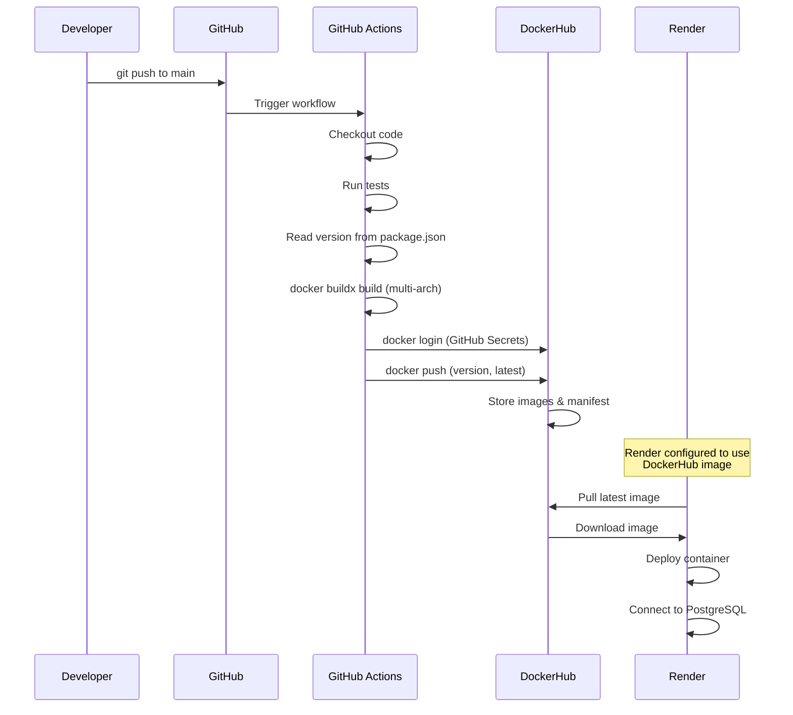

# Design Document - GitHub Actions CI/CD & Render Deployment

## Overview

Este diseño implementa un sistema completo de CI/CD usando GitHub Actions para construir y publicar imágenes Docker a DockerHub, con despliegue automático en Render. El sistema incluye versionado semántico, soporte multi-arquitectura, validación automatizada, y configuración de PostgreSQL nativo en Render, eliminando completamente la dependencia de Supabase y Netlify.

## Architecture

### High-Level Architecture

```
┌─────────────────────────────────────────────────────────────┐
│                    Developer Workflow                        │
├─────────────────────────────────────────────────────────────┤
│  1. Update version in package.json                          │
│  2. Commit and push to main branch                          │
│  3. GitHub Actions automatically triggers                   │
└─────────────────────────────────────────────────────────────┘
                            │
                            ▼
┌─────────────────────────────────────────────────────────────┐
│                  GitHub Actions Workflow                     │
├─────────────────────────────────────────────────────────────┤
│  ┌──────────────┐  ┌──────────────┐  ┌──────────────┐     │
│  │  Checkout    │→ │  Build Image │→ │  Tag & Push  │     │
│  │  - Code      │  │  - Buildx    │  │  - Version   │     │
│  │  - Tests     │  │  - Multi-arch│  │  - Latest    │     │
│  └──────────────┘  └──────────────┘  └──────────────┘     │
└─────────────────────────────────────────────────────────────┘
                            │
                            ▼
┌─────────────────────────────────────────────────────────────┐
│                        DockerHub                             │
├─────────────────────────────────────────────────────────────┤
│  Repository: username/backlog-pro-backend                   │
│  Tags: 1.0.0, 1.0, 1, latest                               │
│  Architectures: linux/amd64, linux/arm64                    │
└─────────────────────────────────────────────────────────────┘
                            │
                            ▼
┌─────────────────────────────────────────────────────────────┐
│                    Render Deployment                         │
├─────────────────────────────────────────────────────────────┤
│  ┌──────────────────┐  ┌──────────────────┐               │
│  │  Docker Service  │  │  PostgreSQL DB   │               │
│  │  - From DockerHub│  │  - Native Render │               │
│  │  - Auto-deploy   │  │  - Internal URL  │               │
│  └──────────────────┘  └──────────────────┘               │
└─────────────────────────────────────────────────────────────┘
```

### Component Interaction Flow



## Components and Interfaces

### 1. GitHub Actions Workflow

**Location:** `.github/workflows/docker-publish.yml`

**Responsibilities:**
- Activarse automáticamente en push a main
- Ejecutar tests antes de construir
- Extraer versión del package.json
- Construir imagen multi-arquitectura usando Docker Buildx
- Autenticar con DockerHub usando GitHub Secrets
- Etiquetar con múltiples tags (version, latest)
- Publicar a DockerHub

**Triggers:**
```yaml
on:
  push:
    branches: [ main ]
  workflow_dispatch:  # Manual trigger option
```

**Required GitHub Secrets:**
- `DOCKERHUB_USERNAME`: Usuario de DockerHub
- `DOCKERHUB_TOKEN`: Access token de DockerHub

### 2. Dockerfile de Producción

**Location:** `Dockerfile.prod`

**Responsibilities:**
- Construir imagen optimizada para producción
- Incluir solo dependencias de producción
- Exponer puerto 3000
- Configurar health check

### 3. Render Configuration

**Service Type:** Docker (Web Service)

**Configuration:**
```yaml
# Render service configuration
Image URL: username/backlog-pro-backend:latest
Port: 3000
Health Check Path: /health (or /graphql)

Environment Variables:
  NODE_ENV: production
  PORT: 3000
  DB_HOST: <internal-postgres-url>
  DB_PORT: 5432
  DB_USERNAME: <render-db-user>
  DB_PASSWORD: <render-db-password>
  DB_DATABASE: <render-db-name>
  DB_SSL: true
  JWT_SECRET: <secret>
```

**PostgreSQL Database:**
- Type: PostgreSQL (Native Render)
- Version: 15+
- Connection: Internal URL provided by Render

### 4. Documentation Files

**Location:** `docs/RENDER_DEPLOYMENT.md`

**Sections:**
- Configuración de GitHub Secrets
- Configuración de servicio Docker en Render
- Configuración de PostgreSQL en Render
- Variables de entorno requeridas
- Proceso de despliegue automático
- Troubleshooting

## Data Models

### Version Information

```typescript
interface VersionInfo {
  full: string;        // "1.2.3"
  major: string;       // "1"
  majorMinor: string;  // "1.2"
  tags: string[];      // ["1.2.3", "1.2", "1", "latest"]
}
```

### Docker Image Metadata

```typescript
interface ImageMetadata {
  repository: string;     // "username/backlog-pro-backend"
  version: string;        // "1.0.0"
  architectures: string[]; // ["linux/amd64", "linux/arm64"]
  tags: string[];         // All applied tags
  size: string;           // Image size
  digest: string;         // SHA256 digest
}
```

### Build Configuration

```typescript
interface BuildConfig {
  dockerfile: string;      // "Dockerfile.prod"
  context: string;         // "."
  platforms: string[];     // ["linux/amd64", "linux/arm64"]
  buildArgs: Record<string, string>;
  tags: string[];
}
```

## Correctness Properties

*A property is a characteristic or behavior that should hold true across all valid executions of a system-essentially, a formal statement about what the system should do. Properties serve as the bridge between human-readable specifications and machine-verifiable correctness guarantees.*

**Property 1: Workflow usa Dockerfile.prod**
*Para cualquier* ejecución del workflow de GitHub Actions, el sistema debe usar Dockerfile.prod como archivo de construcción
**Validates: Requirements 1.2**

**Property 2: Versionado consistente con package.json**
*Para cualquier* publicación de imagen, todas las etiquetas de versión aplicadas deben derivarse del campo "version" en package.json y seguir el formato semántico MAJOR.MINOR.PATCH
**Validates: Requirements 1.3, 4.5**

**Property 3: Autenticación con GitHub Secrets**
*Para cualquier* ejecución del workflow, el sistema debe autenticar con DockerHub usando los secretos DOCKERHUB_USERNAME y DOCKERHUB_TOKEN antes de intentar subir la imagen
**Validates: Requirements 1.4, 2.3**

**Property 4: Push tras autenticación exitosa**
*Para cualquier* autenticación exitosa con DockerHub, el sistema debe proceder a subir la imagen al repositorio especificado
**Validates: Requirements 1.5**

**Property 5: Tag "latest" siempre presente**
*Para cualquier* imagen publicada exitosamente, el sistema debe aplicar la etiqueta "latest" además de las etiquetas de versión específicas
**Validates: Requirements 1.6**

**Property 6: Logs de progreso visibles**
*Para cualquier* ejecución del workflow, el sistema debe emitir logs de progreso para cada fase principal (checkout, tests, build, push) en GitHub Actions
**Validates: Requirements 2.4**

**Property 7: URL de DockerHub en logs**
*Para cualquier* publicación exitosa, el sistema debe mostrar la URL completa de la imagen en DockerHub en los logs del workflow
**Validates: Requirements 2.5**

**Property 8: Puerto 3000 expuesto**
*Para cualquier* imagen publicada, la configuración de la imagen debe incluir EXPOSE 3000 en su metadata
**Validates: Requirements 3.4**

**Property 9: Aplicación inicia con variables de entorno de Render**
*Para cualquier* conjunto completo de variables de entorno de Render (DB_HOST, DB_PORT, etc.), ejecutar la imagen debe resultar en un proceso de aplicación que escucha en el puerto 3000 y conecta con PostgreSQL
**Validates: Requirements 3.5**

**Property 10: Tags semánticos jerárquicos**
*Para cualquier* versión semántica X.Y.Z publicada, el sistema debe crear etiquetas para X.Y.Z, X.Y, y X (además de latest)
**Validates: Requirements 4.3**

**Property 11: Build multi-arquitectura con Buildx**
*Para cualquier* construcción de imagen en el workflow, el sistema debe usar "docker buildx build" con la flag --platform especificando múltiples arquitecturas
**Validates: Requirements 6.1**

**Property 12: Arquitecturas amd64 y arm64 incluidas**
*Para cualquier* imagen publicada, el manifest de la imagen debe listar tanto linux/amd64 como linux/arm64 como plataformas disponibles
**Validates: Requirements 6.2, 6.3**

**Property 13: Compatibilidad multi-arquitectura**
*Para cualquier* arquitectura soportada (amd64 o arm64), ejecutar la imagen debe producir el mismo comportamiento funcional de la aplicación
**Validates: Requirements 6.5**

**Property 14: Tests ejecutados antes de build**
*Para cualquier* ejecución del workflow, el sistema debe ejecutar los tests automatizados y solo continuar con el build si los tests pasan
**Validates: Requirements 7.1, 7.2, 7.4**

## Error Handling

### Error Categories

1. **GitHub Actions Configuration Errors**
   - Missing GitHub Secrets (DOCKERHUB_USERNAME, DOCKERHUB_TOKEN)
   - Invalid workflow YAML syntax
   - Missing package.json or invalid version

2. **Build Errors**
   - Buildx not available in GitHub Actions runner
   - Dockerfile.prod not found
   - Build failures (compilation, dependencies)
   - Test failures blocking build

3. **Authentication Errors**
   - Invalid DockerHub credentials in GitHub Secrets
   - Network connectivity issues
   - DockerHub service unavailable
   - Token expired or revoked

4. **Push Errors**
   - Insufficient permissions on DockerHub repository
   - Repository doesn't exist
   - Network timeout
   - Image size exceeds limits

5. **Render Deployment Errors**
   - Image pull failures from DockerHub
   - Invalid environment variables
   - PostgreSQL connection failures
   - Port binding issues

### Error Handling Strategy

**GitHub Actions Workflow:**
```yaml
# Workflow includes error handling with:
- continue-on-error: false  # Fail fast on errors
- Conditional steps based on previous step success
- Detailed error messages in logs
- Notification on failure (optional)
```

**Error Response Pattern:**
1. **Detect**: Workflow step fails
2. **Log**: Detailed error message in GitHub Actions logs
3. **Notify**: GitHub notifications + optional Slack/Discord
4. **Cleanup**: GitHub Actions automatically cleans up runners
5. **Retry**: Manual re-run or automatic retry on transient failures

### Retry Logic

- **Authentication**: GitHub Actions retries automatically on transient failures
- **Push**: Docker push includes automatic retries (3 attempts)
- **Tests**: No automatic retry (fail fast for quick feedback)
- **Render Deployment**: Render retries automatically on image pull failures

## Testing Strategy

### Automated Testing in GitHub Actions

**Test Execution:**
- Tests run automatically on every push to main before building the image
- Workflow fails if any test fails, preventing broken images from being published
- Test results visible in GitHub Actions logs

**Test Command:**
```yaml
- name: Run tests
  run: npm test
```

### Unit Testing

Usaremos **Jest** (ya configurado en el proyecto) para unit tests:

**Test Coverage:**
- Existing application tests (controllers, services, resolvers)
- Core business logic validation
- Database operations
- GraphQL schema validation

**Example:**
```typescript
describe('Application Health', () => {
  it('should start successfully with valid environment', () => {
    // Test that app initializes correctly
  });
});
```

### Property-Based Testing

Usaremos **fast-check** (ya incluido en devDependencies) si se requieren property tests específicos para la lógica de negocio:

**Configuration:**
- Mínimo 100 iteraciones por propiedad
- Cada test debe referenciar explícitamente la propiedad del diseño

**Note:** Las propiedades de este diseño se enfocan en el workflow de CI/CD y la configuración de infraestructura, no en lógica de aplicación que requiera property-based testing.

### Integration Testing

**GitHub Actions Workflow Testing:**
1. **Workflow Validation**: Validar sintaxis YAML del workflow
2. **Build Test**: Verificar que la imagen se construye correctamente
3. **Multi-arch Test**: Confirmar que ambas arquitecturas se construyen
4. **Push Test**: Verificar que la imagen se sube a DockerHub (usando repositorio de test)

**Render Deployment Testing:**
1. **Image Pull**: Verificar que Render puede descargar la imagen
2. **Container Start**: Confirmar que el contenedor inicia correctamente
3. **Database Connection**: Validar conexión con PostgreSQL de Render
4. **Health Check**: Verificar que la aplicación responde en /graphql

### Manual Testing Checklist

- [ ] Trigger workflow manualmente desde GitHub Actions
- [ ] Verificar que tests pasan antes del build
- [ ] Confirmar que la imagen se construye para ambas arquitecturas
- [ ] Verificar todas las etiquetas en DockerHub (version, latest, major, major.minor)
- [ ] Configurar servicio Docker en Render
- [ ] Configurar PostgreSQL en Render
- [ ] Verificar que Render despliega la imagen correctamente
- [ ] Validar conexión de la aplicación con PostgreSQL
- [ ] Probar endpoint GraphQL en Render
- [ ] Validar documentación paso a paso

## Implementation Notes

### Prerequisites

**GitHub:**
1. **GitHub Repository**: Proyecto debe estar en GitHub
2. **GitHub Secrets**: Configurar DOCKERHUB_USERNAME y DOCKERHUB_TOKEN
3. **GitHub Actions**: Habilitado en el repositorio (habilitado por defecto)

**DockerHub:**
1. **DockerHub Account**: Crear cuenta en hub.docker.com
2. **Access Token**: Generar token con permisos de write
3. **Repository**: Crear repositorio público o privado

**Render:**
1. **Render Account**: Crear cuenta en render.com
2. **PostgreSQL Database**: Crear base de datos PostgreSQL nativa
3. **Docker Service**: Crear servicio tipo "Docker" (no desde repositorio)

### GitHub Actions Workflow Structure

```
.github/
└── workflows/
    └── docker-publish.yml    # Workflow principal de CI/CD
```

**Workflow Steps:**
1. Checkout code
2. Set up Docker Buildx
3. Extract version from package.json
4. Run tests
5. Login to DockerHub
6. Build and push multi-arch image
7. Generate tags (version, major, major.minor, latest)

### Render Service Configuration

**Docker Service:**
```yaml
Name: backlog-pro-backend
Type: Docker
Image URL: username/backlog-pro-backend:latest
Port: 3000
Health Check Path: /graphql
Auto-Deploy: Yes (pulls latest image automatically)
```

**PostgreSQL Database:**
```yaml
Name: backlog-pro-db
Type: PostgreSQL
Version: 15
Plan: Free or Starter
Internal Connection: Provided by Render
```

### Security Considerations

1. **GitHub Secrets**: Nunca commitear credenciales, usar GitHub Secrets
2. **Access Tokens**: Usar tokens de DockerHub, no contraseñas
3. **Token Scope**: Limitar permisos del token solo a push
4. **Render Environment Variables**: Configurar variables sensibles en Render dashboard
5. **Database SSL**: Habilitar SSL para conexión PostgreSQL en producción
6. **JWT Secret**: Usar secreto fuerte y único en Render

### Performance Optimization

1. **Layer Caching**: Optimizar Dockerfile.prod para reutilización de capas
2. **Parallel Builds**: Buildx construye arquitecturas en paralelo automáticamente
3. **Build Cache**: GitHub Actions cachea layers de Docker entre builds
4. **Render Auto-Deploy**: Render detecta nuevas imágenes y despliega automáticamente
5. **PostgreSQL Connection Pooling**: Configurar pool de conexiones en TypeORM

### Monitoring and Observability

**GitHub Actions:**
- Build time y logs en GitHub Actions dashboard
- Notificaciones de fallo/éxito por email
- Badge de status en README

**DockerHub:**
- Estadísticas de descargas
- Tamaño de imágenes
- Historial de versiones

**Render:**
- Logs de aplicación en tiempo real
- Métricas de CPU y memoria
- Uptime monitoring
- Database metrics
